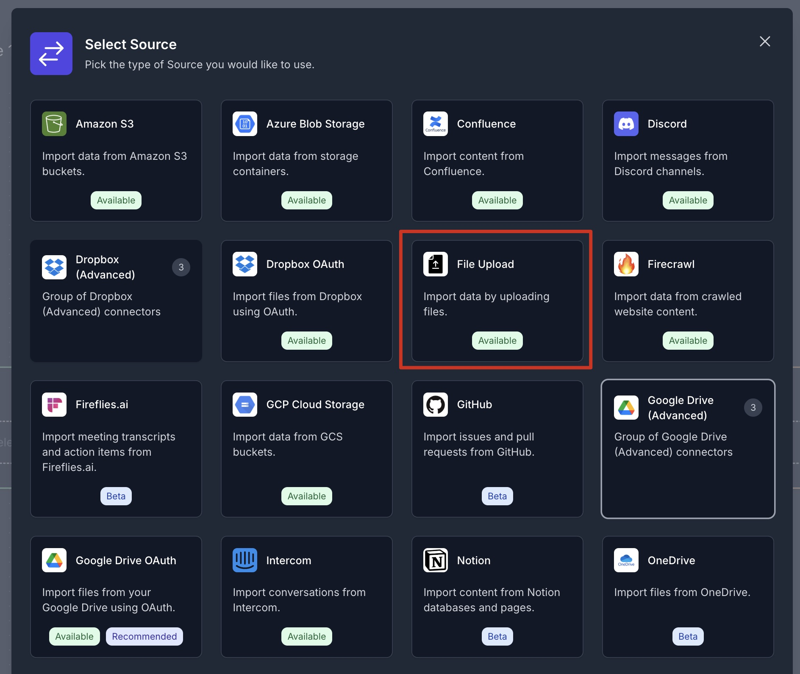

# Lab 4: Creating a RAG Pipeline from File Uploads

In this lab, you will build a Retrieval-Augmented Generation (RAG) pipeline using Vectorize. You’ll upload datasheet PDFs as your source data, chunk and embed them, and deploy your pipeline to enable real-time retrieval.

---

## 📁 Prerequisites

Before you begin:

1. Clone the workshop repository:

   ```bash
   git clone git@github.com:vectorize-io/rag-101-workshop.git
   cd rag-101-workshop
   ```

2. Ensure you have access to [platform.vectorize.io](https://platform.vectorize.io) with an active organization account.

---

## 🚀 Step-by-Step Instructions

### Step 1: Create a New Pipeline

From the sidebar in the Vectorize platform, click **"New RAG Pipeline"**.


---

### Step 2: Select Your Source

Click the **"Select Source"** box to configure the pipeline’s data source.


---

### Step 3: Choose "File Upload" as Source Type

In the connector gallery, select **File Upload**.



---

### Step 4: Add a New Connector

Click **"Add a new connector"**.


---

### Step 5: Upload Your Datasheet PDFs

From the cloned `rag-101-workshop/agent-pdfs` folder, select the provided datasheets and drag them into the upload box.


---

### Step 6: Name and Confirm

Name your connector `datasheets`, then click **Confirm Selection**.


---

### Step 7: Configure the Extractor

Set the extraction strategy to **Fast**, the chunking strategy to **Paragraph**, chunk size to `500` tokens, and overlap to `50`.


---

### Step 8: Choose an AI Platform

In the Embedder block, click **Select AI Platform**, then choose the **Built-in** option.


---

### Step 9: Choose a Vector Database

Select the **Built-in** Vectorize vector database.


---

### Step 10: Name and Deploy

Name your pipeline `Datasheets`, then click **Deploy RAG Pipeline**.


---

## ✅ What’s Next?

Once deployed, your pipeline is ready to perform RAG queries. You can now:

- Test retrieval using the **RAG Evaluations** tab.
- Add metadata extraction with **Iris**.
- Iterate on chunking, embedding, and source selection for optimal results.

---

## 🧪 Lab Summary

In this lab, you:

- Created a new RAG pipeline.
- Connected a file upload source with PDF datasheets.
- Configured chunking, embedding, and vector storage.
- Deployed a working RAG pipeline.

You're now ready to build more advanced retrieval workflows!
